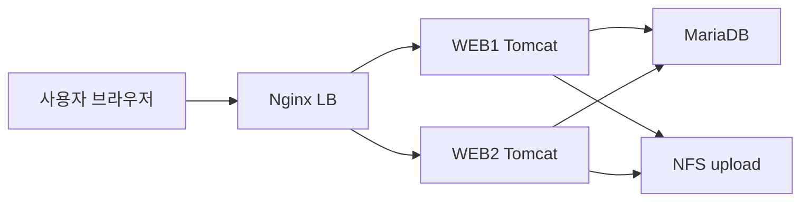
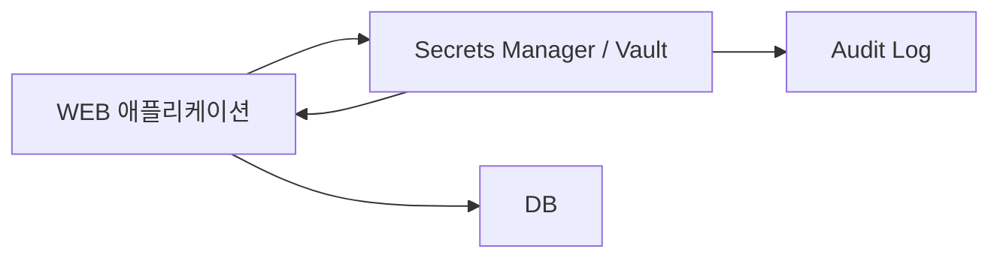

# Secrets Management

상태: 보고서 초안
작성 기준: 2026-05-06
작성 원칙: 실제 비밀번호, 토큰, 키 값은 문서에 기록하지 않는다.

## 1. 이 문서를 쓰는 이유

우리 프로젝트는 사용자가 WEB 서버에 접속하고, WEB 서버가 DB와 NFS를 사용하는 3-Tier 구조에 가깝다.

```text
사용자
  -> DNS
  -> LB VIP
  -> WEB1/WEB2 Tomcat
  -> DB
  -> NFS upload
```

처음에는 DB 서버의 3306 포트를 WEB1/WEB2에서만 접근 가능하게 막으면 충분히 안전하다고 생각하기 쉽다. 하지만 실제 공격에서는 공격자가 DB를 바로 뚫지 않고, 먼저 WEB 서버를 장악한 뒤 WEB 서버가 원래 가지고 있던 DB 접속 권한을 악용한다.

이 문서의 목적은 다음 질문에 답하는 것이다.

- DB 비밀번호를 코드나 WAR 안에 넣으면 왜 위험한가?
- WEB 서버가 침해되면 공격자는 어디서 DB 정보를 찾는가?
- 환경 변수 방식은 무엇을 해결하고, 무엇을 해결하지 못하는가?
- Vault나 Secrets Manager는 왜 더 안전한가?
- 현재 우리 프로젝트 수준에서 현실적으로 할 수 있는 방법은 무엇인가?

핵심 결론은 다음과 같다.

> DB 비밀번호를 Git, WAR, 문서, 스크린샷에 남기면 안 된다. 현재 수업 수준에서는 환경 변수와 서버 전용 설정 파일로 분리하는 것이 현실적인 1차 목표다. 다만 환경 변수도 WEB 서버가 완전히 장악되면 읽힐 수 있으므로, 실무 수준에서는 Vault/Secrets Manager, 최소 권한 DB 계정, 회전, 감사 로그가 필요하다.

## 2. Secret이란 무엇인가

Secret은 외부에 노출되면 권한 탈취나 데이터 유출로 이어질 수 있는 민감한 값이다.

우리 프로젝트에서 Secret이 될 수 있는 값은 다음과 같다.

| 종류 | 예시 | 노출 시 영향 |
|---|---|---|
| DB 계정 | DB username | DB 접속 시도 가능 |
| DB 비밀번호 | DB password | DB 데이터 조회/변조 가능 |
| API Key | 외부 서비스 key | 외부 서비스 오남용 |
| OAuth Secret | Kakao, Google 같은 로그인 연동 secret | 사용자 인증 흐름 탈취 가능 |
| SSH Private Key | 서버 접속 key | 서버 접근 권한 탈취 가능 |
| JWT Secret | 토큰 서명 key | 가짜 로그인 토큰 생성 가능 |

Secret은 코드가 아니다. Secret은 코드 밖에서 관리해야 한다.

## 3. 정상 데이터 흐름

정상적인 사용자는 DB 비밀번호를 알 필요가 없다. 사용자는 브라우저로 WEB에 요청을 보내고, DB 접속은 WEB 애플리케이션이 대신 수행한다.



이 흐름에서 DB 접속 정보가 필요한 주체는 사용자 브라우저가 아니라 WEB 애플리케이션이다.

따라서 "외부에서 주입한다"는 말은 사용자가 웹 화면에 DB 비밀번호를 입력한다는 뜻이 아니다. Git/WAR 같은 코드 묶음 밖에 있는 서버 환경이나 배포 시스템이 애플리케이션 실행 시점에 값을 넣어준다는 뜻이다.

## 4. 침해 시나리오

공격자는 보통 DB부터 직접 공격하지 않는다. DB는 ACL과 방화벽으로 WEB 서버에서만 접근 가능하게 막혀 있기 때문이다.

대신 다음 흐름을 노린다.

```text
1. 공격자가 WEB1의 취약점을 찾는다.
2. 파일 업로드, 취약한 라이브러리, 잘못된 Tomcat 설정 등을 이용해 WEB1에서 코드 실행 권한을 얻는다.
3. 공격자는 root가 아니라 tomcat 같은 일반 서비스 계정 권한만 얻을 수도 있다.
4. 하지만 tomcat 계정은 애플리케이션 설정 파일을 읽을 수 있다.
5. 설정 파일 안에 DB 계정/비밀번호가 있으면 공격자는 그것을 읽는다.
6. DB ACL은 WEB1의 접속을 허용하므로, 공격자는 WEB1에서 DB에 접속한다.
7. DB 데이터를 조회하거나 덤프한다.
```

이때 DB 방화벽은 완전히 무력한 것이 아니다. 외부 직접 접근은 막아준다. 하지만 WEB 서버가 이미 침해된 상황에서는 "WEB에서 오는 DB 접속"이 정상 접속인지 공격자 접속인지 구분하기 어렵다.

그래서 네트워크 ACL만으로는 부족하다.

## 5. DB 정보가 흔히 노출되는 위치

Spring Boot/Tomcat 프로젝트에서 DB 정보가 들어가기 쉬운 위치는 다음과 같다.

| 위치 | 위험 |
|---|---|
| `application.properties` | WAR 안에 포함될 수 있음 |
| `application.yml` | 설정 전체가 Git에 올라갈 수 있음 |
| Tomcat 설정 파일 | tomcat 계정이나 운영자가 읽을 수 있음 |
| 배포 스크립트 | Git에 올라가면 그대로 노출 |
| DB 설치 스크립트 | 계정 생성 SQL에 비밀번호가 남을 수 있음 |
| 보고서/스크린샷 | 실습 중 무심코 값이 노출될 수 있음 |
| shell history | 터미널에 입력한 비밀번호가 남을 수 있음 |

문서에는 실제 값을 쓰지 않고 위치와 위험만 기록한다. 예를 들어 "DB 비밀번호가 `application.properties`에 있었다"라고는 쓸 수 있지만, 실제 비밀번호 문자열은 쓰지 않는다.

## 6. 하드코딩 방식

가장 위험한 방식은 DB 접속 정보를 코드나 설정 파일에 직접 쓰는 것이다.

```properties
spring.datasource.url=jdbc:mariadb://DB_IP:3306/DB_NAME
spring.datasource.username=DB_USER
spring.datasource.password=DB_PASSWORD
```

위 예시는 형식 설명을 위한 예시이며 실제 값을 넣으면 안 된다.

하드코딩의 문제는 다음과 같다.

- GitHub에 올라가는 순간 Secret이 외부에 퍼질 수 있다.
- WAR 파일을 가진 사람은 설정을 추출할 수 있다.
- WEB 서버가 침해되면 공격자가 파일을 읽을 수 있다.
- 비밀번호를 바꾸려면 코드/설정/배포물을 다시 수정해야 한다.
- 보고서나 캡처에 값이 찍히기 쉽다.

하드코딩은 수업 실습에서는 편해 보이지만, 보안 관점에서는 가장 먼저 제거해야 하는 방식이다.

## 7. 환경 변수 방식

환경 변수 방식은 코드에는 값이 아니라 변수 이름만 넣고, 실제 값은 서버 실행 환경에서 주입하는 방식이다.

Spring 설정은 다음처럼 둔다.

```properties
spring.datasource.url=${DB_URL}
spring.datasource.username=${DB_USER}
spring.datasource.password=${DB_PASSWORD}
```

그리고 서버에는 별도 환경 파일을 둔다.

```text
/etc/zzaphub/zzaphub.env
```

환경 파일 예시는 다음과 같은 형식이다. 실제 값은 문서에 쓰지 않는다.

```bash
DB_URL=jdbc:mariadb://DB_HOST:3306/DB_NAME
DB_USER=APP_DB_USER
DB_PASSWORD=CHANGE_ME_ON_SERVER_ONLY
```

권한은 최소화한다.

```bash
sudo mkdir -p /etc/zzaphub
sudo chown root:root /etc/zzaphub
sudo chmod 755 /etc/zzaphub
sudo chown root:root /etc/zzaphub/zzaphub.env
sudo chmod 600 /etc/zzaphub/zzaphub.env
```

systemd로 Tomcat이나 애플리케이션을 실행한다면 service 파일에서 `EnvironmentFile`로 읽게 할 수 있다.

```ini
[Service]
EnvironmentFile=/etc/zzaphub/zzaphub.env
```

환경 변수 방식의 장점:

- Git에 실제 비밀번호를 올리지 않아도 된다.
- WAR 안에 실제 비밀번호가 들어가지 않는다.
- 서버별로 다른 DB 계정을 줄 수 있다.
- 비밀번호 변경 시 코드 수정 없이 서버 환경만 바꿀 수 있다.

환경 변수 방식의 한계:

- WEB 서버가 완전히 장악되면 환경 변수도 읽힐 수 있다.
- 같은 계정으로 실행 중인 프로세스의 환경을 `/proc`에서 볼 수 있는 경우가 있다.
- 환경 변수를 로그에 출력하면 그대로 유출된다.
- rotation과 감사 로그는 수동에 가깝다.

따라서 환경 변수는 "하드코딩보다 안전한 1차 개선"이지, 최종 보안 해답은 아니다.

## 8. Vault / Secrets Manager 방식

Vault나 Secrets Manager는 Secret을 전용 저장소에 보관하고, 애플리케이션이 필요할 때 인증을 거쳐 가져오는 방식이다.

대표 예시:

- HashiCorp Vault
- AWS Secrets Manager
- AWS Systems Manager Parameter Store
- Azure Key Vault
- GCP Secret Manager

기본 흐름은 다음과 같다.



장점:

- Secret이 코드와 서버 파일에 직접 남지 않는다.
- 누가 언제 Secret을 읽었는지 감사 로그를 남길 수 있다.
- 자동 rotation을 구성할 수 있다.
- 동적 DB 계정을 만들어 짧은 시간만 사용할 수 있다.
- Secret 접근 권한을 서비스별로 세밀하게 나눌 수 있다.

단점:

- 별도 서버나 클라우드 서비스가 필요하다.
- 애플리케이션 코드나 배포 구조가 복잡해진다.
- Vault 자체의 인증/권한/백업도 관리해야 한다.
- 수업 프로젝트 수준에서는 구현 범위가 커질 수 있다.

실무 보안 기준으로는 Vault/Secrets Manager가 더 좋다. 하지만 현재 프로젝트에서는 환경 변수 분리와 최소 권한 DB 계정부터 적용하는 것이 현실적이다.

## 9. 우리 토폴로지에 적용하기

우리 토폴로지에서는 ACL이 이미 중요한 역할을 한다.

| 흐름 | 정책 |
|---|---|
| 사용자 -> LB VIP | 허용 |
| 사용자 -> WEB1/WEB2 직접 | 차단 |
| 사용자 -> DB 직접 | 차단 |
| WEB1/WEB2 -> DB | 허용 |
| WEB1/WEB2 -> Log | 허용 |
| 외부 -> Monitor | 차단 |

이 구조는 좋은 출발점이다. 하지만 WEB이 침해되면 공격자는 WEB의 허용된 DB 접근 경로를 이용할 수 있다.

따라서 Secret 관리와 함께 다음 원칙을 적용해야 한다.

### 9.1 DB 계정 최소 권한

WEB 애플리케이션 계정은 필요한 DB와 테이블에만 접근해야 한다.

예를 들어 게시판 애플리케이션이면 전체 DB 관리자 권한이 아니라, 애플리케이션 DB에 대한 필요한 권한만 주는 것이 맞다.

피해야 할 것:

- `root` 계정으로 애플리케이션 접속
- 모든 DB에 대한 권한
- 모든 IP에서 접속 가능한 DB 계정
- WEB1/WEB2가 같은 고권한 계정을 공유

### 9.2 WEB별 DB 계정 분리

가능하면 WEB1과 WEB2에 서로 다른 DB 계정을 줄 수 있다.

예시:

```text
WEB1 -> app_web1_user
WEB2 -> app_web2_user
```

이렇게 하면 WEB1이 침해되었을 때 WEB1 계정만 폐기하거나 비밀번호를 바꿀 수 있다. 수업 프로젝트에서는 번거로울 수 있으므로 최소한 "운영 개선안"으로 보고서에 넣을 수 있다.

### 9.3 로그에 Secret 출력 금지

환경 변수나 설정 값을 확인한다고 `printenv`, `env`, `cat application.properties` 결과를 그대로 캡처하면 안 된다.

로그에 남기면 안 되는 것:

- DB 비밀번호
- API key
- JWT secret
- OAuth client secret
- SSH private key

보고서에는 Secret 값을 마스킹한다.

```text
DB_PASSWORD=********
```

### 9.4 유출 시 회전

Secret이 한 번이라도 Git, 보고서, 채팅, 스크린샷에 노출되었다면 삭제만으로 끝나지 않는다. 이미 복사되었을 수 있기 때문에 값을 새로 바꿔야 한다.

유출 시 순서:

```text
1. 노출 위치 확인
2. 노출된 계정/비밀번호 즉시 변경
3. 애플리케이션 환경 파일 갱신
4. 서비스 재시작
5. DB 접속 로그 확인
6. Git 기록에 남았으면 기록 정리 또는 repository 재발급 검토
7. 보고서/캡처에서 값 제거
```

## 10. 현재 수준에서 할 수 있는 적용안

현재 우리 수준에서 가장 현실적인 적용안은 다음이다.

1. `application.properties`에는 실제 DB 비밀번호를 쓰지 않는다.
2. `${DB_URL}`, `${DB_USER}`, `${DB_PASSWORD}` 같은 변수 참조만 남긴다.
3. 실제 값은 서버의 `/etc/zzaphub/zzaphub.env` 같은 파일에 둔다.
4. 해당 파일은 Git에 올리지 않는다.
5. 파일 권한은 `root:root`, `600`으로 제한한다.
6. Tomcat/systemd가 실행 시점에 환경 파일을 읽게 한다.
7. DB 계정은 애플리케이션 전용 계정을 사용한다.
8. WEB1/WEB2에서만 DB 접근을 허용하는 ACL을 유지한다.
9. 로그와 보고서에는 Secret 값을 절대 출력하지 않는다.
10. 유출되었다고 의심되면 값을 새로 바꾼다.

이 방식은 Vault만큼 강하지 않다. 그래도 하드코딩보다 훨씬 낫고, 수업 프로젝트에서 구현 가능한 현실적인 보안 개선이다.

## 11. 점검 명령

Secret이 들어갈 가능성이 있는 파일을 찾을 때는 아래처럼 검색할 수 있다.

주의: 실제 값이 출력될 수 있으므로 화면 공유, 캡처, 보고서 작성 중에는 조심한다.

```bash
grep -RInE 'password|passwd|secret|token|spring\.datasource|DB_PASSWORD|DB_USER' .
```

Git에 올라갈 파일을 확인한다.

```bash
git status --short
git diff --cached
```

서버 환경 파일 권한을 확인한다.

```bash
ls -l /etc/zzaphub/zzaphub.env
```

애플리케이션 실행 계정이 무엇인지 확인한다.

```bash
ps -ef | grep -E 'tomcat|java'
systemctl status tomcat --no-pager
```

DB 접속이 WEB에서만 되는지 확인한다.

```bash
mysql -h DB_HOST -u APP_DB_USER -p
```

위 명령에서 비밀번호를 명령줄 인자로 직접 쓰지 않는다. 명령줄 인자는 shell history나 프로세스 목록에 남을 수 있다.

## 12. 보고서에 쓸 수 있는 결론

현재 프로젝트에서는 DB 서버를 ACL로 보호하고 WEB 서버만 DB에 접근하도록 제한했다. 그러나 WEB 서버가 침해되면 공격자는 WEB 서버가 가진 DB 접근 권한을 악용할 수 있다.

따라서 DB 비밀번호를 코드나 WAR에 하드코딩하지 않고, 서버 환경에서 주입하는 구조로 바꾸는 것이 필요하다. 현재 수준에서는 환경 변수와 서버 전용 환경 파일을 사용하는 것이 현실적인 1차 개선안이다.

다만 환경 변수도 WEB 서버가 완전히 장악되면 읽힐 수 있으므로, 실무 수준에서는 Vault/Secrets Manager, DB 계정 최소 권한, Secret rotation, 감사 로그, 중앙 로그 모니터링까지 함께 설계해야 한다.
