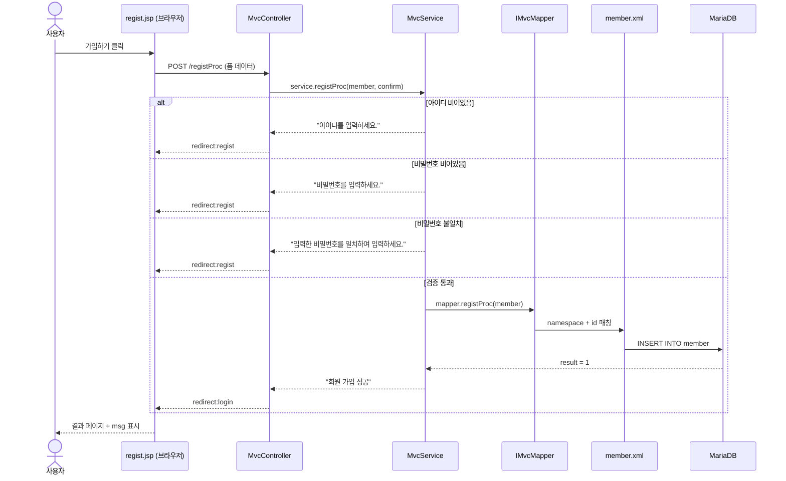
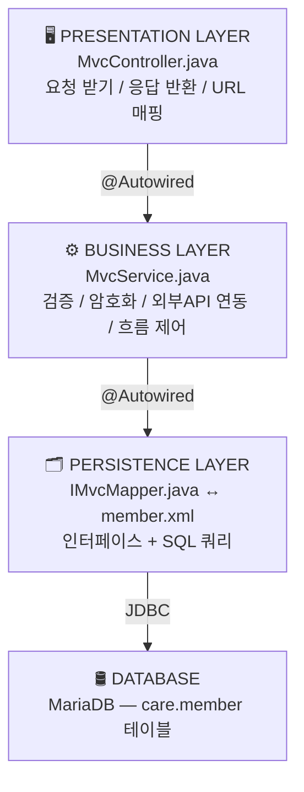
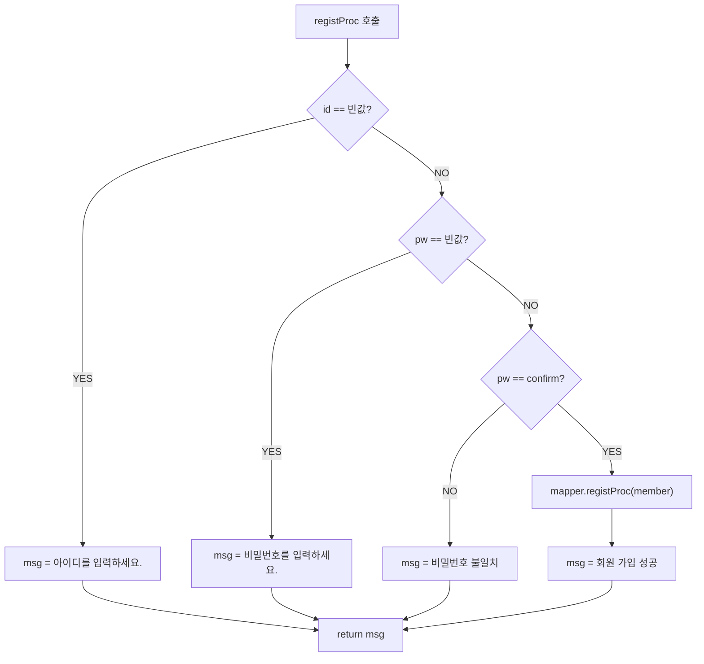
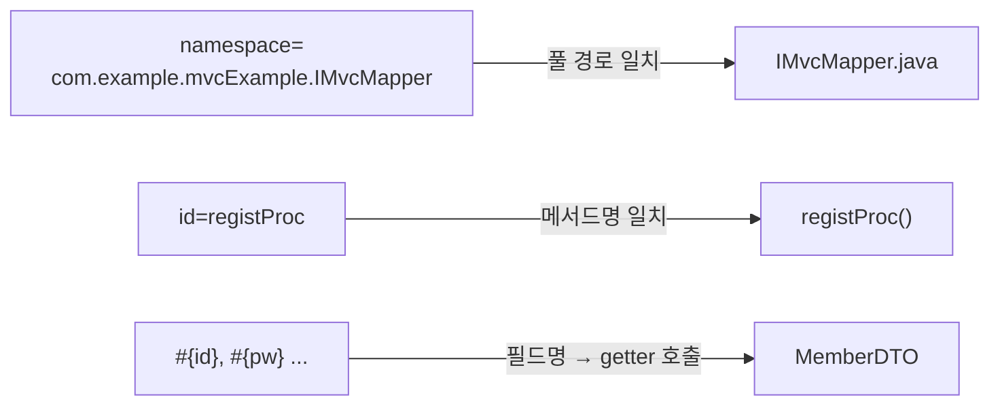
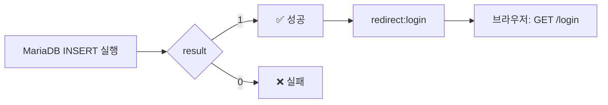
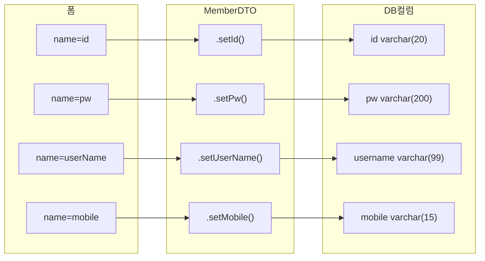

# Spring MVC + MyBatis — 회원가입 데이터 흐름 v2

> 📅 작성일: 2026-04-20 🔄 업데이트: 2026-04-20 — Service 검증 로직 추가, Controller 조건 분기 리다이렉트 추가 🏷️ 태그: #Spring #MVC #MyBatis #Java #흐름정리 📚 출처: Spring Boot 공식 문서, MyBatis 공식 문서 (mybatis.org) — 2024 기준

---

## 1. 전체 흐름 한눈에 보기



---

## 2. 계층 구조 (MVC 패턴)



---

## 3. 단계별 상세 설명

### STEP 1 — 브라우저 → Controller

사용자가 `regist.jsp`에서 **[가입하기]** 클릭 → `<form method="post" action="registProc">` 실행 → HTTP POST 요청이 Body에 폼 데이터를 담아 전송

```
HTTP POST /registProc
Body: id=user77&pw=1234&confirm=1234&userName=유저&...
```

**Controller에서 받는 방식:**

```java
@PostMapping("registProc")
public String registProc(MemberDTO member, String confirm) {
    // ↑ Spring이 폼의 name 속성 ↔ MemberDTO 필드명 자동 매칭
    // ↑ confirm은 MemberDTO에 없어서 String으로 따로 받음
}
```

> 💡 **자동 바인딩 원리** Spring이 `@ModelAttribute`(생략 가능)를 통해 폼의 `name="id"` → `MemberDTO.setId()` 자동 호출

---

### STEP 2 — Controller → Service

```java
@PostMapping("registProc")
public String registProc(MemberDTO member, String confirm, RedirectAttributes ra) {
    String msg = service.registProc(member, confirm); // ← 이제 String 반환
    ra.addFlashAttribute("msg", msg);                 // ← msg를 다음 페이지로 전달
    if (msg.equals("회원 가입 성공"))
        return "redirect:login";   // ✅ 성공 시 로그인 페이지
    else
        return "redirect:regist";  // ❌ 실패 시 가입 페이지로 되돌아감
}
```

|키워드|동작|URL 변화|
|---|---|---|
|`forward:login`|서버 내부에서 이동|`/registProc` 그대로 유지|
|`redirect:login`|브라우저에게 새 GET 요청 명령|`/login` 으로 변경 ✅|
|`redirect:regist`|검증 실패 시 가입 폼으로 복귀|`/regist` 로 변경|

> 💡 **RedirectAttributes란?** `redirect:` 이후 다음 페이지로 데이터를 **1회성**으로 전달하는 방법 `addFlashAttribute("msg", msg)` → 다음 요청에서 `${msg}`로 꺼내 쓸 수 있음 새로고침하면 사라짐 (1회용)

> ⚠️ **redirect를 쓰는 이유** forward 쓰면 새로고침 시 POST 요청이 **재전송**됨 → 중복 가입 위험 redirect는 새로고침해도 GET 재요청만 일어남 → 안전

---

### STEP 3 — Service 역할

```java
// MvcService.java
public String registProc(MemberDTO member, String confirm) {
    String msg = "";

    if (member.getId() == "") {                          // ① 아이디 빈값 체크
        msg = "아이디를 입력하세요.";
    } else if (member.getPw() == "") {                   // ② 비밀번호 빈값 체크
        msg = "비밀번호를 입력하세요.";
    } else if (member.getPw().equals(confirm) == false) { // ③ 비밀번호 일치 체크
        msg = "입력한 비밀번호를 일치하여 입력하세요.";
    } else {                                             // ④ 검증 통과 → DB 저장
        int result = mapper.registProc(member);
        msg = "회원 가입 성공";
    }
    return msg; // Controller로 결과 문자열 반환
}
```



> ⚠️ **버그 주의 — `==` vs `.equals()`**
> 
> ```java
> // ❌ 현재 코드 (잘못된 방법)
> if (member.getId() == "")
> 
> // ✅ 올바른 방법
> if (member.getId().equals(""))
> // 또는
> if (member.getId().isEmpty())
> ```
> 
> Java에서 `==`는 **메모리 주소(참조값)** 비교 String 내용 비교는 반드시 `.equals()` 또는 `.isEmpty()` 사용 `==`로 비교하면 빈 문자열 체크가 **제대로 안 될 수 있음**

|Service의 역할|현재 구현 여부|
|---|---|
|빈값 검증|✅ 구현됨|
|비밀번호 일치 검증|✅ 구현됨|
|비밀번호 암호화|❌ 미구현 (BCrypt 필요)|
|외부 API 연동|❌ 미구현|
|중복 ID 체크|❌ 미구현|

---

### STEP 4 — Mapper Interface (IMvcMapper)

```java
@Mapper
public interface IMvcMapper {
    public int registProc(MemberDTO member);
    // 구현 코드({}) 없음 — MyBatis가 런타임에 자동 생성
}
```

> 💡 **파일명 앞 `I` 의 의미** Java 네이밍 컨벤션: `I` = Interface 임을 명시 강제 규칙은 아니지만 팀 협업 시 가독성을 위해 사용

> 💡 **`{}` 구현부가 없는 이유** MyBatis가 `member.xml`을 읽고 **런타임에 자동으로 구현체를 생성**해서 주입해줌 개발자는 SQL만 XML에 작성하면 됨

---

### STEP 5 — member.xml → DB

```xml
<mapper namespace="com.example.mvcExample.IMvcMapper">
    <insert id="registProc">
        INSERT INTO member VALUES(
            #{id}, #{pw}, #{userName}, #{postCode},
            #{address}, #{detailAddress}, #{mobile}
        )
    </insert>
</mapper>
```

**3가지 매칭 포인트:**



**application.properties — XML 위치 등록:**

```properties
mybatis.mapper-locations=/mappers/*.xml
# /mappers/ 폴더 안의 모든 .xml 파일을 Mapper로 인식
```

---

### STEP 6 — DB 처리 후 반환



---

## 4. 파일별 역할 요약표

|파일|계층|핵심 역할|
|---|---|---|
|`regist.jsp`|View|사용자 입력 폼 표시|
|`MvcController.java`|Controller|URL 매핑, 요청/응답 처리|
|`MvcService.java`|Service|비즈니스 로직 (검증, 암호화 등)|
|`IMvcMapper.java`|Mapper|DB 작업 인터페이스 정의|
|`member.xml`|SQL|실제 SQL 쿼리 작성|
|`MemberDTO.java`|DTO|데이터 전달 객체 (setter/getter)|
|`application.properties`|설정|DB 연결, 경로 설정|

---

## 5. DTO가 데이터를 나르는 방식



> 💡 **DTO(Data Transfer Object)란?** 계층 간 데이터를 담아 나르는 단순한 그릇 로직 없이 setter/getter만 존재 `alt + shift + s` → Eclipse에서 자동 생성 가능

---

## 6. ⚠️ 현재 코드 보완 필요 사항

|위치|문제|해결 방향|
|---|---|---|
|`MvcService`|`== ""` 로 String 비교|`.equals("")` 또는 `.isEmpty()` 로 변경|
|`MvcService`|비번 평문 저장|`BCryptPasswordEncoder` 적용|
|`MvcService`|중복 ID 체크 없음|DB 조회 후 존재 여부 확인 로직 추가|
|`member.xml`|INSERT 컬럼명 미지정|컬럼명 명시 (순서 변경 대비)|
|`application.properties`|파일명 `propertise` 오타|실제 파일명 확인 필요|

**member.xml 권장 형태:**

```xml
INSERT INTO member (id, pw, username, postcode, address, detailaddress, mobile)
VALUES (#{id}, #{pw}, #{userName}, #{postCode}, #{address}, #{detailAddress}, #{mobile})
```

**String 비교 수정:**

```java
// ❌ 현재
if (member.getId() == "")

// ✅ 수정
if (member.getId() == null || member.getId().isEmpty())
```

---

## 7. 핵심 어노테이션 정리

| 어노테이션          | 위치                  | 역할                     |
| -------------- | ------------------- | ---------------------- |
| `@Controller`  | MvcController       | Spring MVC 컨트롤러 등록     |
| `@Service`     | MvcService          | 비즈니스 로직 Bean 등록        |
| `@Mapper`      | IMvcMapper          | MyBatis Mapper Bean 등록 |
| `@Autowired`   | Controller, Service | 의존성 자동 주입 (DI)         |
| `@GetMapping`  | Controller 메서드      | GET 요청 매핑              |
| `@PostMapping` | Controller 메서드      | POST 요청 매핑             |
## 💀 [Code Review] 클로드가 찾아낸 버그의 '진짜 물리적 이유'

>[!danger] 🚨 아키텍트의 팩트 폭격: "클로드가 '이렇게 고치세요'라고 정답을 줬지만, 왜 그래야 하는지 원리(Why)를 모르면 강도님은 내일 또 똑같은 버그를 낸다."

### 🔍 1. `==` vs `.equals()` : 자바 메모리(RAM)의 끔찍한 함정
- **강도님의 코드:** `if (member.getId() == "")`
- **클로드의 지적:** `==`는 메모리 주소를 비교하므로 `.equals("")`를 써라.
- **수석 아키텍트의 심층 해부:** 
  자바에서 `==` 연산자는 상자 안의 내용물(글자)을 비교하는 게 아니라, **"두 상자가 RAM의 똑같은 위치(주소)에 있는가?"**를 묻는 명령어다. 
  사용자가 폼에 아무것도 안 치고 넘기면 스프링은 힙(Heap) 메모리에 새로운 빈 상자(`new String("")`)를 만든다. 하지만 강도님이 코드에 적은 `""`는 스트링 풀(String Pool)이라는 전혀 다른 메모리 공간에 있다. 
  **결과:** 내용물은 둘 다 빈칸이지만, 메모리 주소가 다르므로 `==`는 `false`를 뱉는다. 강도님의 빈칸 검증 로직은 완벽하게 무력화된 상태였다.

### 🛡️ 2. DevSecOps의 시선: 비밀번호 평문 저장 (The Ultimate Sin)
- **클로드의 지적:** 비번 평문 저장 ❌ 미구현 (BCrypt 필요)
- **수석 아키텍트의 심층 해부:** 
  지금 강도님의 DB에는 `1234`라는 비밀번호가 그대로(Plaintext) 저장되고 있다. 만약 해커가 SQL 인젝션으로 DB를 털어가면? 고객들의 비밀번호가 전 세계 해커 포럼에 뿌려지고 회사는 파산한다.
  **해결책:** 나중에 스프링 시큐리티(Spring Security)를 배우면, `1234`를 `$2a$10$Dow...` 같은 60자리 쓰레기 문자열로 단방향 암호화(Hashing)하는 **`BCryptPasswordEncoder`**를 서비스(Service) 계층에 무조건 도입해야 한다.

### 🗄️ 3. XML 쿼리의 취약점: 컬럼명 생략의 대참사
- **클로드의 지적:** `INSERT INTO member VALUES (...)` ➡️ 컬럼명 명시 권장
- **수석 아키텍트의 심층 해부:** 
  강도님처럼 `VALUES`만 냅다 적으면, 나중에 DB 테이블에 `email` 컬럼이 하나 추가되는 순간 쿼리 순서가 꼬이면서 서버가 즉사한다. 
  반드시 `INSERT INTO member (id, pw, username...) VALUES (#{id}, #{pw}...)` 처럼 **명시적 매핑(Explicit Mapping)**을 해야 인프라 변경에 강건한(Robust) 코드가 된다.