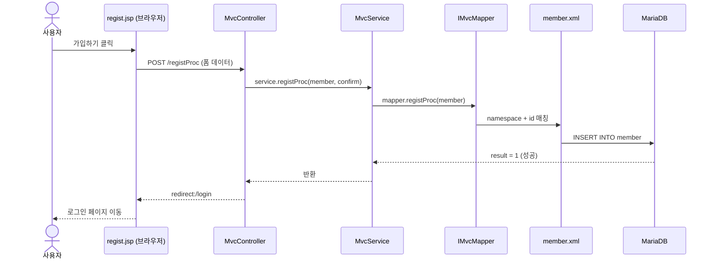
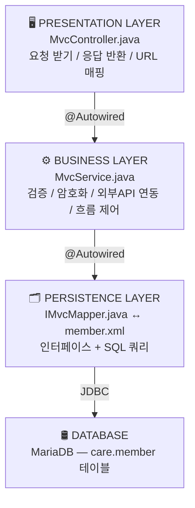
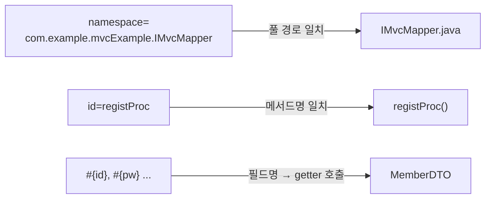
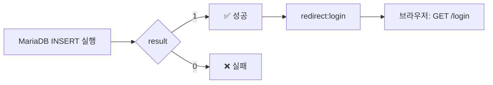
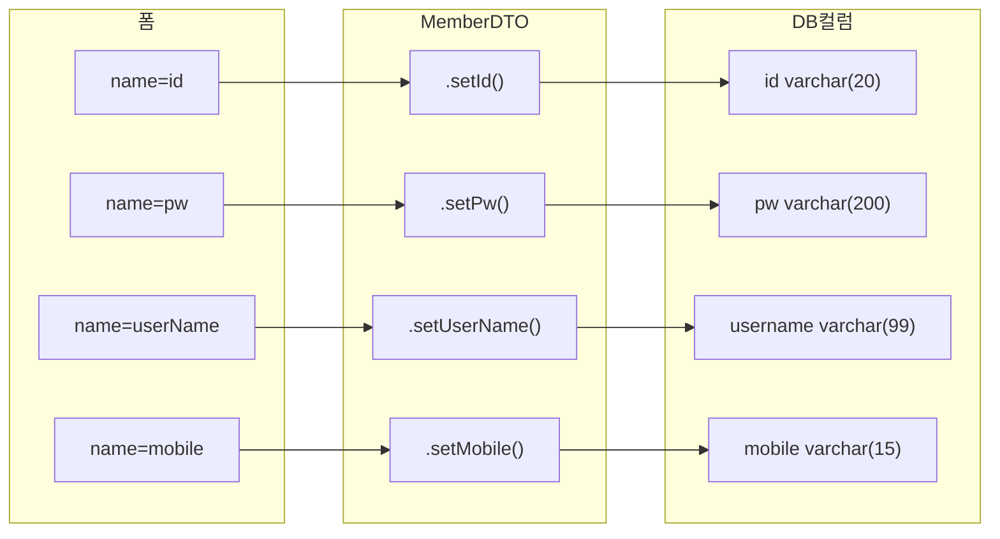

# Spring MVC + MyBatis — 회원가입 데이터 흐름

> 📅 작성일: 2026-04-20 🏷️ 태그: #Spring #MVC #MyBatis #Java #흐름정리 📚 출처: Spring Boot 공식 문서, MyBatis 공식 문서 (mybatis.org) — 2024 기준

---

## 1. 전체 흐름 한눈에 보기



---

## 2. 계층 구조 (MVC 패턴)



---

## 3. 단계별 상세 설명

### STEP 1 — 브라우저 → Controller

사용자가 `regist.jsp`에서 **[가입하기]** 클릭 → `<form method="post" action="registProc">` 실행 → HTTP POST 요청이 Body에 폼 데이터를 담아 전송

```
HTTP POST /registProc
Body: id=user77&pw=1234&confirm=1234&userName=유저&...
```

**Controller에서 받는 방식:**

```java
@PostMapping("registProc")
public String registProc(MemberDTO member, String confirm) {
    // ↑ Spring이 폼의 name 속성 ↔ MemberDTO 필드명 자동 매칭
    // ↑ confirm은 MemberDTO에 없어서 String으로 따로 받음
}
```

> 💡 **자동 바인딩 원리** Spring이 `@ModelAttribute`(생략 가능)를 통해 폼의 `name="id"` → `MemberDTO.setId()` 자동 호출

---

### STEP 2 — Controller → Service

```java
service.registProc(member, confirm);
return "redirect:login";
```

|키워드|동작|URL 변화|
|---|---|---|
|`forward:login`|서버 내부에서 이동|`/registProc` 그대로 유지|
|`redirect:login`|브라우저에게 새 GET 요청 명령|`/login` 으로 변경 ✅|

> ⚠️ **redirect를 쓰는 이유** forward 쓰면 새로고침 시 POST 요청이 **재전송**됨 → 중복 가입 위험 redirect는 새로고침해도 GET /login만 재요청됨 → 안전

---

### STEP 3 — Service 역할

```java
// MvcService.java
public void registProc(MemberDTO member, String confirm) {
    int result = mapper.registProc(member);  // ← DB에 INSERT
    System.out.println("결과: " + result);   // 성공 시 1 출력
}
```

|Service의 원래 역할 (현재 미구현)|설명|
|---|---|
|비밀번호 검증|`confirm == member.getPw()` 확인|
|비밀번호 암호화|BCrypt 해시 처리 후 DB 저장|
|외부 API 연동|카카오/네이버/구글 소셜 로그인|
|데이터 유효성 검사|중복 ID 체크 등|

---

### STEP 4 — Mapper Interface (IMvcMapper)

```java
@Mapper
public interface IMvcMapper {
    public int registProc(MemberDTO member);
    // 구현 코드({}) 없음 — MyBatis가 런타임에 자동 생성
}
```

> 💡 **파일명 앞 `I` 의 의미** Java 네이밍 컨벤션: `I` = Interface 임을 명시 강제 규칙은 아니지만 팀 협업 시 가독성을 위해 사용

> 💡 **`{}` 구현부가 없는 이유** MyBatis가 `member.xml`을 읽고 **런타임에 자동으로 구현체를 생성**해서 주입해줌 개발자는 SQL만 XML에 작성하면 됨

---

### STEP 5 — member.xml → DB

```xml
<mapper namespace="com.example.mvcExample.IMvcMapper">
    <insert id="registProc">
        INSERT INTO member VALUES(
            #{id}, #{pw}, #{userName}, #{postCode},
            #{address}, #{detailAddress}, #{mobile}
        )
    </insert>
</mapper>
```

**3가지 매칭 포인트:**



**application.properties — XML 위치 등록:**

```properties
mybatis.mapper-locations=/mappers/*.xml
# /mappers/ 폴더 안의 모든 .xml 파일을 Mapper로 인식
```

---

### STEP 6 — DB 처리 후 반환



---

## 4. 파일별 역할 요약표

|파일|계층|핵심 역할|
|---|---|---|
|`regist.jsp`|View|사용자 입력 폼 표시|
|`MvcController.java`|Controller|URL 매핑, 요청/응답 처리|
|`MvcService.java`|Service|비즈니스 로직 (검증, 암호화 등)|
|`IMvcMapper.java`|Mapper|DB 작업 인터페이스 정의|
|`member.xml`|SQL|실제 SQL 쿼리 작성|
|`MemberDTO.java`|DTO|데이터 전달 객체 (setter/getter)|
|`application.properties`|설정|DB 연결, 경로 설정|

---

## 5. DTO가 데이터를 나르는 방식



> 💡 **DTO(Data Transfer Object)란?** 계층 간 데이터를 담아 나르는 단순한 그릇 로직 없이 setter/getter만 존재 `alt + shift + s` → Eclipse에서 자동 생성 가능

---

## 6. ⚠️ 현재 코드 보완 필요 사항

|위치|문제|해결 방향|
|---|---|---|
|`MvcService`|`confirm` 비번 검증 없음|`if (!confirm.equals(member.getPw()))` 추가|
|`MvcService`|비번 평문 저장|`BCryptPasswordEncoder` 적용|
|`member.xml`|INSERT 컬럼명 미지정|컬럼명 명시 (순서 변경 대비)|
|`application.properties`|파일명 `propertise` 오타|실제 파일명 확인 필요|

**member.xml 권장 형태:**

```xml
INSERT INTO member (id, pw, username, postcode, address, detailaddress, mobile)
VALUES (#{id}, #{pw}, #{userName}, #{postCode}, #{address}, #{detailAddress}, #{mobile})
```

---

## 7. 핵심 어노테이션 정리

|어노테이션|위치|역할|
|---|---|---|
|`@Controller`|MvcController|Spring MVC 컨트롤러 등록|
|`@Service`|MvcService|비즈니스 로직 Bean 등록|
|`@Mapper`|IMvcMapper|MyBatis Mapper Bean 등록|
|`@Autowired`|Controller, Service|의존성 자동 주입 (DI)|
|`@GetMapping`|Controller 메서드|GET 요청 매핑|
|`@PostMapping`|Controller 메서드|POST 요청 매핑|